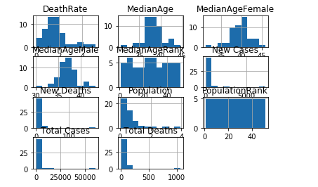

# COVID-19 Data Analysis

### Sravan Kumar Kannuri
### March 31,2020

[Sravan Covid-19 MEDIUM-BLOG-URL](https://medium.com/@shravank/covid-19-impact-on-the-usa-b51213ad4ff7)

## I. Definition

This code helps in analysis current Corona situation in USA like reasons for Spread, Death Rates and Predicts Future Hotspots.

### Project Overview
Different parts of the United States are seeing different levels of impact from a couple of weeks. Here I am trying to draw some conclusions for a few scenarios based on the data available in the public domain.

Following websites helped in research of current subject.

[cdv](https://www.cdc.gov/coronavirus/2019-ncov/prevent-getting-sick/index.html)

[median_age](https://en.wikipedia.org/wiki/List_of_countries_by_median_age)

### Problem Statement

Can we get answers for following question from data ?

1. What are the parameters for the spread of COVID-19?
2. What are the most death rate states in the USA and why?
3. Which states are going to be next hotspots in the USA?

## II. Analysis
### Data Exploration

I have Data downloaded from following websites.

worldometers provides an up to date cases count per country and state wise. So far all the 50 states are affected. 

[worldometers](https://www.worldometers.info/coronavirus/country/us/)

##### Data Labels:

###### State - USA State name 
###### Total Cases - cumulative number of total cases so far
######  New Cases - new cases on a particular day
######  Total - cumulative number of total Deaths so far
######  New Deaths - new deaths on a particular day

worldpopulationreview provides demographic attributes like total population and mean age values.

[worldpopulationreview](https://worldpopulationreview.com/states/median-age-by-state/)

######  State - USA State name  
######  Population - Total poplulation per state
######  MedianAge - MedianAge of the state 
######  MedianAgeMale	- MedianAge of the Male in state
######  MedianAgeFemale - MedianAge of the Female in state

### Exploratory Visualization

Highest statewide cases chart

Highest statewide Deathrate 

Histogram for corona cases with demographics

## III. Methodology

### Data Preprocessing
There is abnormalities like of missing data in-between. In order to get the consistency, there are multiple methodologies.

1. Remove NAN values

2. Fill 0 for missing data

3. Fill mean values

4. Fill forward and Backward Fill

### Implementation
#### Challenges :
1. Collecting right sets of data and finding our correlation between them was complex part
2. Drawing conclusions based on assumptions

## IV. Results

1. Population and MeanAge will be the main factors for corona spread and deaths

## V. Conclusion

Prevention is better than cure

In current situations, the US government is concentrating on testing and treating patients. Parallelly they should work to stop the spreadings. 

Heatmap

Population 

MeanAge

